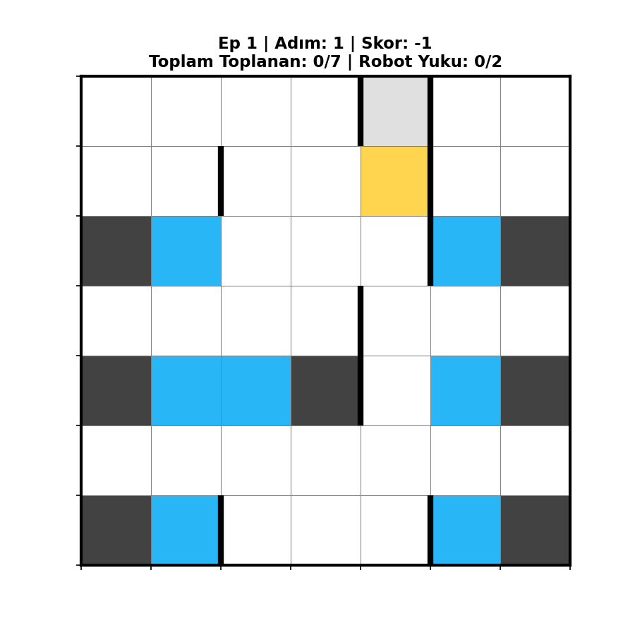
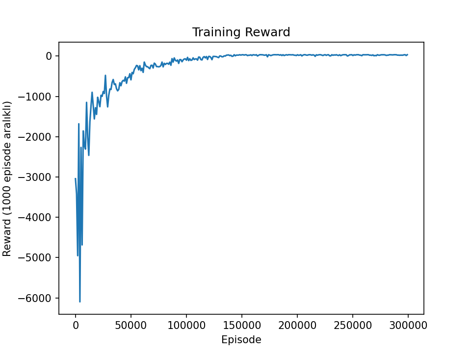

# RobotLoad-Qlearning
Bu proje, fabrika ortamında gezen bir robotun farklı konumlardaki yükleri toplamaya, engellerden kaçınmaya çalışmaktadır. Robot maksimum 2 yük taşıma kapasitesine sahiptir ve topladığı yükleri boşaltıma noktasına teslim etme görevini pekiştirmeli öğrenme ile çözmektedir. Yani robot, deneme-yanılma ile en kısa sürede tüm yükleri toplayarak en uygun hareket stratejisini öğrenmektedir.

## Ortam Tasarımı
* 7x7’lik bir (grid) harita oluşturulmuştur.
* 7 tane Makina konumu yani yasaklı bölge belirlenmiştir.
* 7 farklı bölgede yükler bulunmaktadır
* Robotun başlangıç noktası ve Yük boşaltım noktası sabittir.
* Robotun Kapasite sınırı 2'dir. 

### Durum Uzayı Hesaplama
Ortamın toplam durum sayısı; robotun konumu (7x7), yüklerin toplanma durumu (7 yükün her biri için alındı/alınmadı durumu $$2^7$$) ve robotun anlık yük kapasitesi (0: Bos, 1, 2: Dolu) kombinasyonlarıyla hesaplanmaktadır.

$$
\text{Durum Uzayı} = (7 \times 7) \times 2^7 \times 3 = \mathbf{18,816} \text{ Toplam Durum Vardır.}
$$

## Geçiş Tablosu (Transition Table) ve Q-Table
Her durum ve her eylem için olası geçişler (Hedef durumlar, Ödül ve Ceza, Oyun bitti (Termination) Bilgisi) önceden hesaplanmıştır. Ajan eğitimi sırasında 18,816 satır ve 6 sütundan (eylemler) oluşan devasa bir Q-Tablosu optimize edilir.

## Eylemler 
Robotun 6 farklı eylem gerçekleştirebilir:
* Aşağı 
* Yukarı 
* Sağa 
* Sola 
* Yük Alma 
* Yük Boşaltma 

### Bit Maskeleme ile Yük Takibi
Her yükün toplanma durumu bir bit maskesi ile takip edilmektedir. 7-bit'lik bir maske kullanılarak her bit bir yükün durumunu temsil eder. Bu maskeleme ile **Yük Alma** eyleminde, yükün alınıp alınmadığını durumunu ve ilgili yük alındıysa ilgili bitin değerini değiştirmek üzere işlemler gerçekleştirilir. 

Örneğin, 3. ve 5. yükler toplanmışsa **0010100** bit dizilimi ile gösterilmektedir.

## Ödül – Ceza Sistemi
Yukardaki eylemlere göre ödül veya ceza belirlenir.
* Her adım: -1
* Yasaklı bölgeye hareket: -5
* Hatalı Yük alımı: -10
* Hatalı yük bırakma: -10
* Başarılı Yük alımı: +2
* Başarılı Tek yük boşaltma: +5
* Başarılı Çift yük boşaltma: +15
* Tüm yükler toplandı: +25 Oyun Bitti!

## Eğitim (Q-Learning)
Performansı iyileştirmek için kullanılan parametre ayarları:
* alpha = 0.1 (Ogrenme Orani)
* gamma = 0.99 (Gelecek odaklilik)
* epsilon = 0.5 (Kesif Orani)
* epsilon_decay = 0.03 (Azalma miktarı)
* epsilon_min = 0.05 (Minimum keşif)

Keşif oranı minimum değerin altına düşmediği sürece her 5000 iterasyonda 0.03 azaltılır.

Toplam 400.000 bölüm (episode) çalıştırılmıştır.

**Q-Tablosu** oluşturulur (Tablonun başlangıçta tüm değerleri 0 dır.) ve ajan her adımda keşfederek tabloyu güncelleyerek eğitilir. Daha sonrasında ajan bu tabloya bakarak hangi durumda ne yapacağını belirler.

Her 1000 episode’de alınan toplam ödül kaydedilmiş ve aşağıdaki eğitim grafiği oluşturulmuştur.

## Test 
Eğitilen Ajanın adım adım hareketleri görselleştirilerek test edilmiştir. Bu görüntüler birleştirilerek aşağıdaki GIF oluşturulmuştur. 
Son durumda toplam Ödül 31'dir. Toplam adım ise 61'dir.

